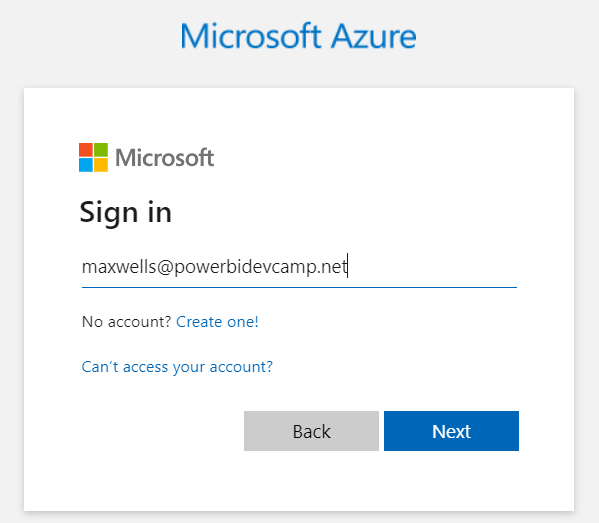

# Fabric-ISV-Playbook Developer Sample

This GitHub repository contains the source code for a developer sample
named **FabricIsvPlaybook**. The **FabricIsvPlaybook** developer sample
is a .NET 8 console application project based on C# and the **Fabric .NET SDK** that can be open
and run using Visual Studio 2022 or Visual Studio Code. The main purpose
of the **FabricIsvPlaybook** project is to give Fabric developers a
jumpstart into designing and implementing code to automate creating and
configuring Fabric workspaces and workspace items including semantic
models, reports, lakehouses, notebooks, warehouses, data pipelines and
shortcuts.


## Assumptions, Limitations and Temporary Workaround

While the core elements of the Fabric REST API reached GA in the first
half of 2024, full support for executing API calls as a service
principal and other essential functionality such as the forthcoming
Connections API will be incrementally released throughout the 2024
calendar year. The June 2024 release of the **FabricIsvPlaybook**
project is based on the following assumptions and workarounds.

- Fabric User API calls are executed with a user identity, not a service
  principal identity

- User authentication is configured with the **Microsoft** **Azure
  PowerShell** first-party application

- Setting credentials for DirectLake semantic models uses a Power BI
  REST API workaround

You can expect that the **FabricIsvPlaybook** project will be updated as
incremental enhancements on Fabric platform become available to
customers. In the meantime, developers can use this project as a
starting point to begin writing and testing the programming logic for
multitenant solutions which leverage Fabric building blocks such as
lakehouses, warehouse and eventhouses. The logic that developers write
today to extend **FabricIsvPlaybook** project will be relatively easy to
adapt to use best practices once the Connections API and full support
for service principals becomes available.

## User Authentication with Entra Id

The **FabricIsvPlaybook** project has been designed to provide Fabric
developers with a quick way to get up and running to write and test code
using the Fabric REST API which creates and configures Fabric workspaces
and workspace items. When running and testing the **FabricIsvPlaybook**
project, there’s no need to create your own custom Entra Id application.
Instead, the **FabricIsvPlaybook** project is configured to authenticate
users with a Microsoft first-arty application named **Microsoft**
**Azure PowerShell** which as an application Id of
**1950a258-227b-4e31-a9cf-717495945fc2**.

Microsoft originally released the **Microsoft** **Azure PowerShell**
application to provide PowerShell programmers with the ability to
acquire access tokens by calling **Get-AzAccessToken**. This
infrastructure provides PowerShell script authors with the ability to
implement an authentication flow to acquire an access token in a single
line of code.

```powershell
$token = Get-AzAccessToken -Resource URL "https://graph.microsoft.com/"
```

Over time, the Microsoft developer community has discovered that the
**Microsoft** **Azure PowerShell** application can be leveraged when
developing custom applications that do not use PowerShell. The primary
value of using the **Microsoft** **Azure PowerShell** application is
convenience. It removes the need to create a custom application in Entra
Id and it simplifies configuring delegated permission scopes. You should
also take note that this convenience is more appropriate for development
environments and far less appropriate for most production environments.

The **Microsoft** **Azure PowerShell** application simplifies token
acquisition by defining a single delegated permission scope named
**user_impersonation**. This is a special permission scope that grants
your application code with all the permissions that have been granted to
the current user. When the **FabricIsvPlaybook** project calls Entra Id
to acquire an access token for the Fabric REST API, it just needs to
pass a single delegated scope.

```
public static readonly string[] Fabric_User_Impresonation = new string[] {
  "https://api.fabric.microsoft.com/user_impersonation"
};
```

The **user_impersonation** permission scope is only supported in
Microsoft first-party applications. When you create a custom Entra Id
application, you cannot rely on the convenience of the
**user_impersonation** permission scope. Instead, your application must
acquire access tokens by passing a far more granular set of permission
scopes defined by the Fabric REST API.

```
public static readonly string[] TenantProvisioning = new string[] {
  "https://api.fabric.microsoft.com/Capacity.ReadWrite.All",
  "https://api.fabric.microsoft.com/Workspace.ReadWrite.All",
  "https://api.fabric.microsoft.com/Item.ReadWrite.All",
  "https://api.fabric.microsoft.com/Item.Read.All",
  "https://api.fabric.microsoft.com/Item.Execute.All",
  "https://api.fabric.microsoft.com/Content.Create",
  "https://api.fabric.microsoft.com/Dataset.ReadWrite.All ",
  "https://api.fabric.microsoft.com/Report.ReadWrite.All",
  "https://api.fabric.microsoft.com/Workspace.GitCommit.All"
};
```

As you have seen, the **FabricIsvPlaybook** project is configured to use
the **Microsoft** **Azure PowerShell** application to simplify and speed
up the process of getting developers up and running with the Fabric REST
API in a development environment.

The **FabricIsvPlaybook** project contains a C# class named
**EntraIdTokenManager** which encapsulates the code and logic to
interact with the Entra Id service and acquire access tokens. When you
press the {F5} key to run the **FabricIsvPlaybook** project in the
Visual Studio debugger, there is code in the **EntraIdTokenManager**
class which starts an authentication flow to acquire an access token.
The first time you run the **FabricIsvPlaybook** project, you will be
redirected to a browser and prompted to sign in using your Entra Id user
account.



Once you sign in interactively, the Entra Id service returns to your
application with an access token and a refresh token. There is code in
the **EntraIdTokenManager** class that implements token caching. This
eliminates the need to perform an interactive sign in each time you run
the application.

\[TODO\] Finish authentication section

## Demonstration Provisioning Flows

Here is what we have

- Demo01: Create Customer Tenant with User

- Demo02: Create Tenant with Imported <span class="mark">Semantic</span>
  Model

- Demo03: Create Tenant with Lakehouse and Notebook

- Demo04: Create Tenant with Warehouse and Data Pipelines

- Demo05: Create Tenant with Shortcut and Load Table API

- Demo06: Create Tenant with Warehouse and SqlClient

- Demo07: Create Tenant with ADLS Gen2 API
