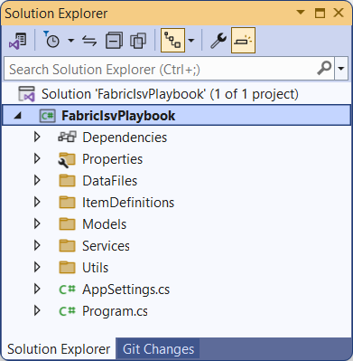

**Fabric-ISV-Playbook Developer Sample**

This GitHub repository contains the source code for a developer sample
named **FabricIsvPlaybook**. The **FabricIsvPlaybook** developer sample
is a .NET 8 console application project written in C# that can be open
and run using Visual Studio 2022 or Visual Studio Code. The main purpose
of this **FabricIsvPlaybook** project is to give Fabric developers a
jump start into designing and implementing code to automate creating and
configuring Fabric workspaces and workspace items including semantic
models, reports, lakehouses, notebooks, warehouses, data pipelines and
shortcuts.

More to come
